# Python Text Editor #
##### Text editor created with Python3 and Tkinter for a GUI, with multithreaded features. #####

To run the file, enter the following command into a terminal
>python3 EditorMul.py

### Functions:
#### File Menu:
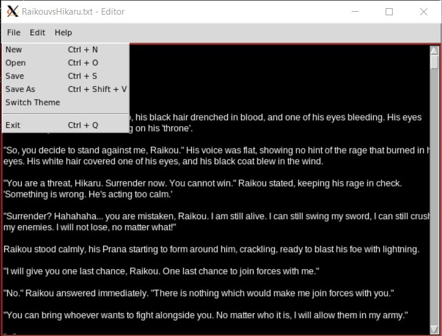

##### New File:
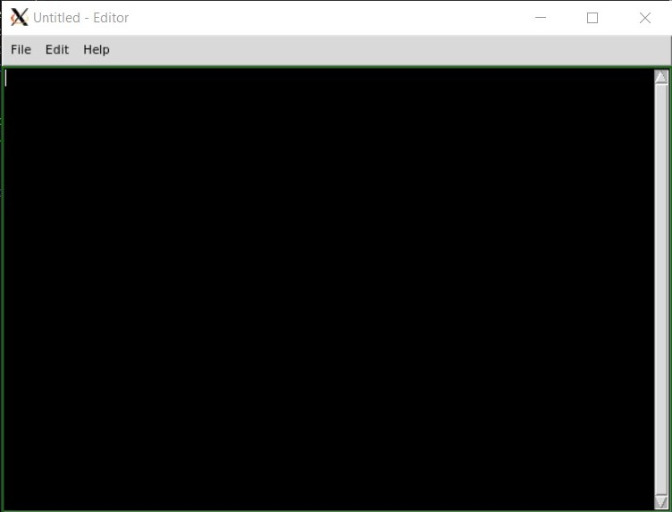

##### Open File:
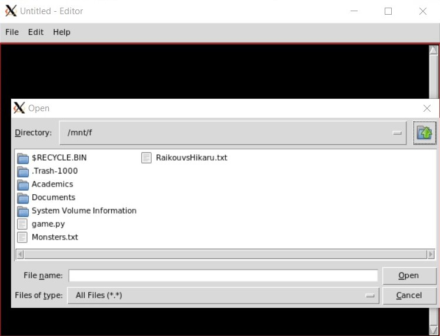
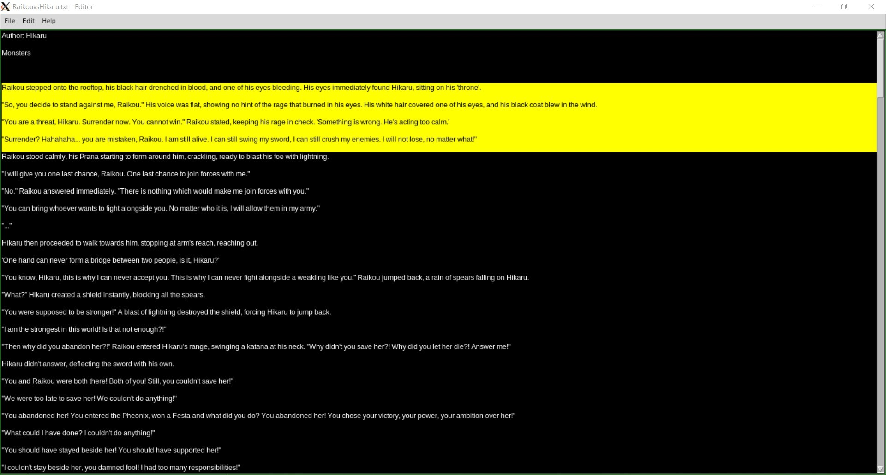

##### Save File:
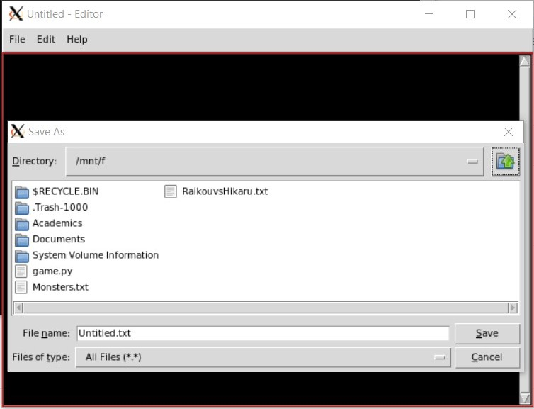

##### Save As:
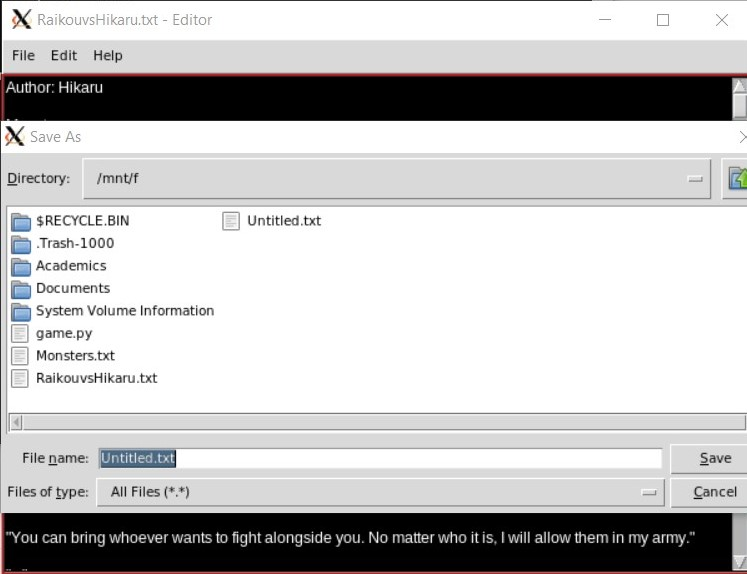

##### Switch Theme:
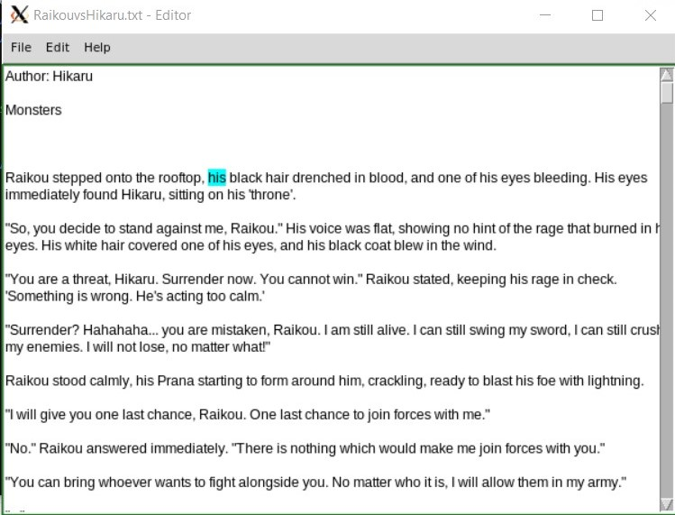
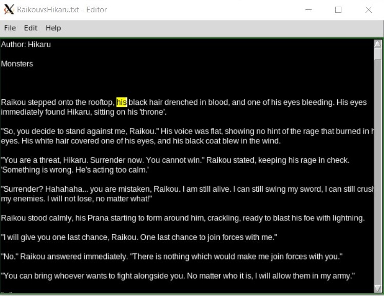

#### Edit Menu:
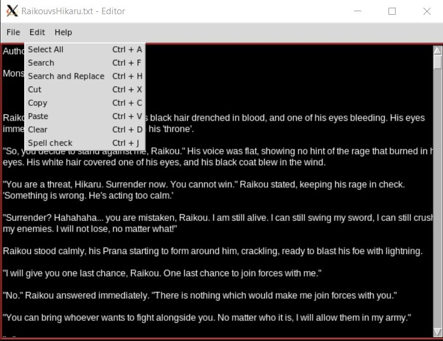

##### Select All:
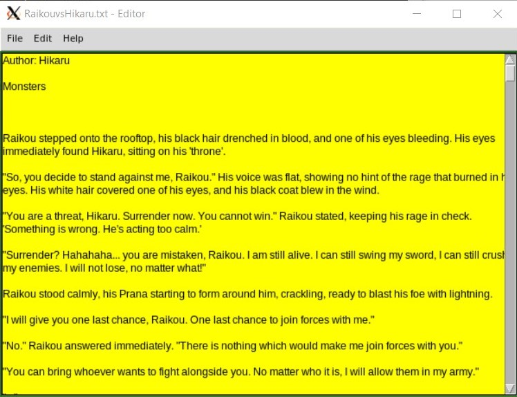

##### Find:
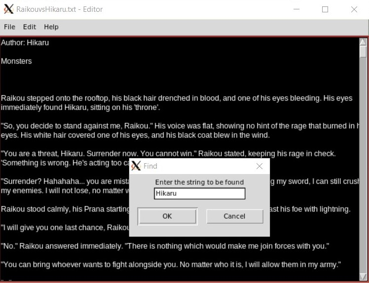
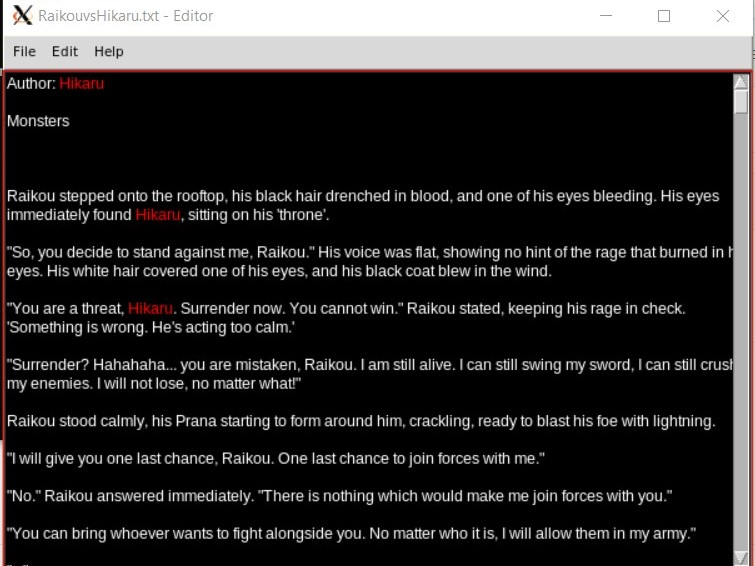

##### Find and Replace:
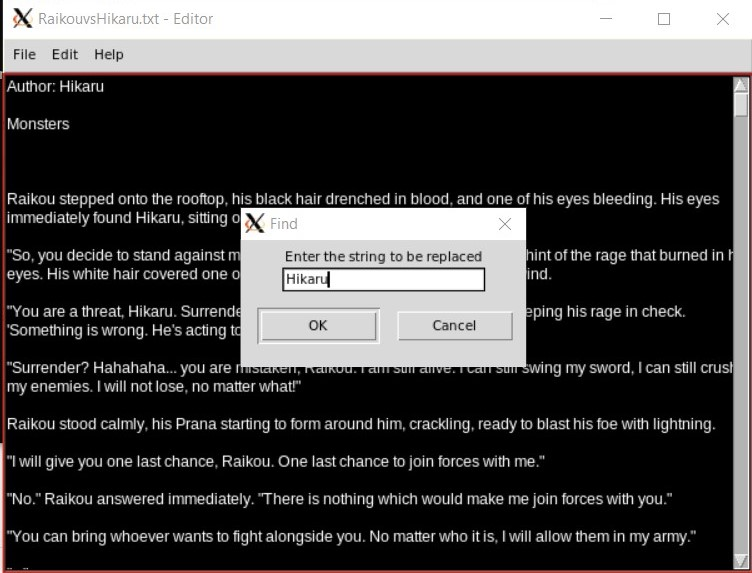
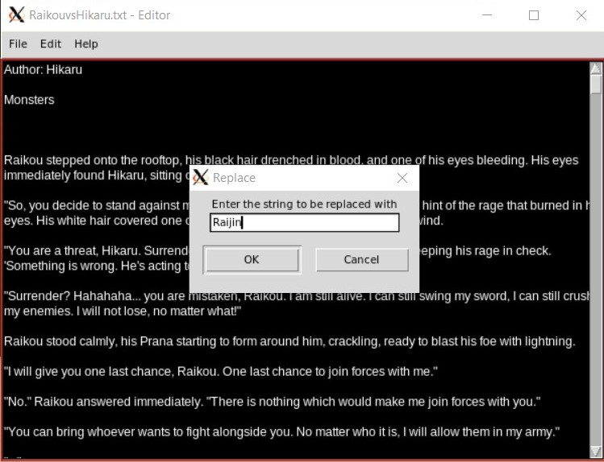
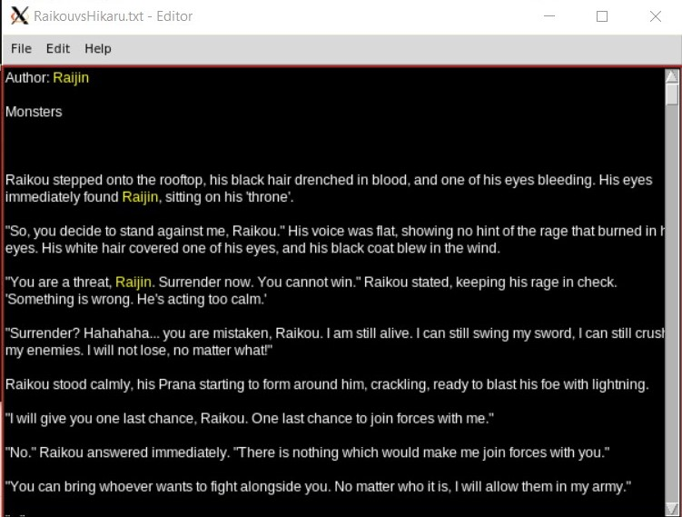

##### Clear All:
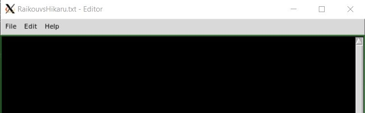

##### Spell Check:
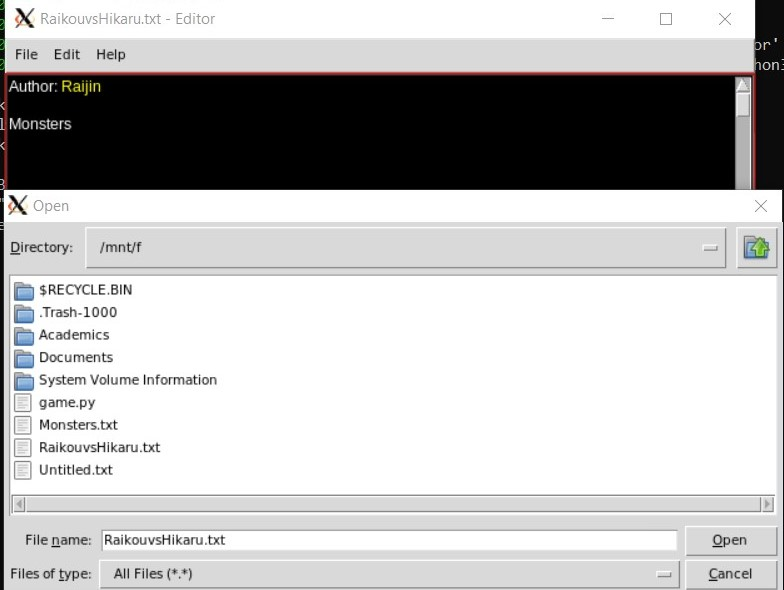
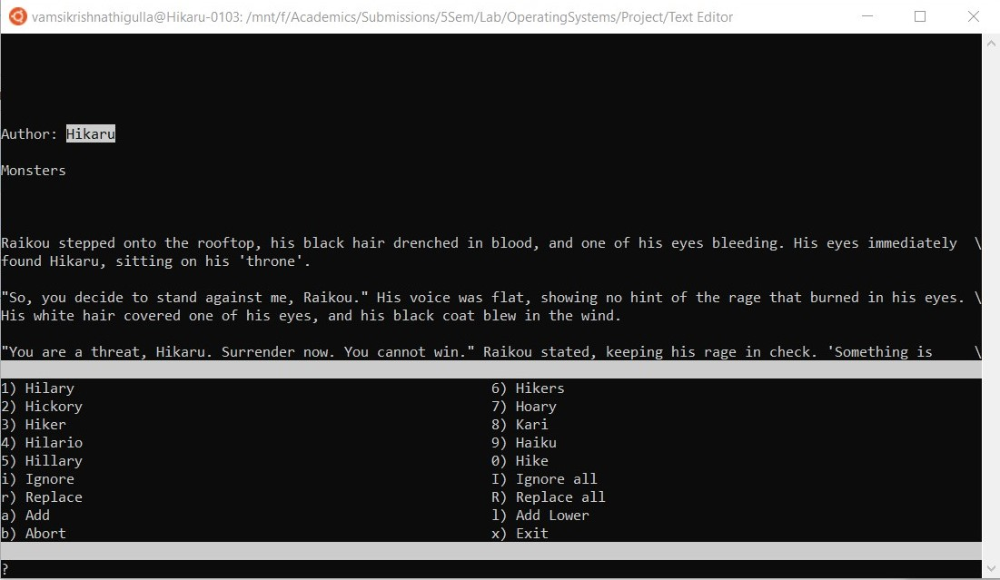
**Note:** Spell Check function works only with .txt files.
> def __SpellCheck(self,event = None):
>		t1=threading.Thread(target=self.__SpellChecker())
>		t1.start()
>		t1.join()
