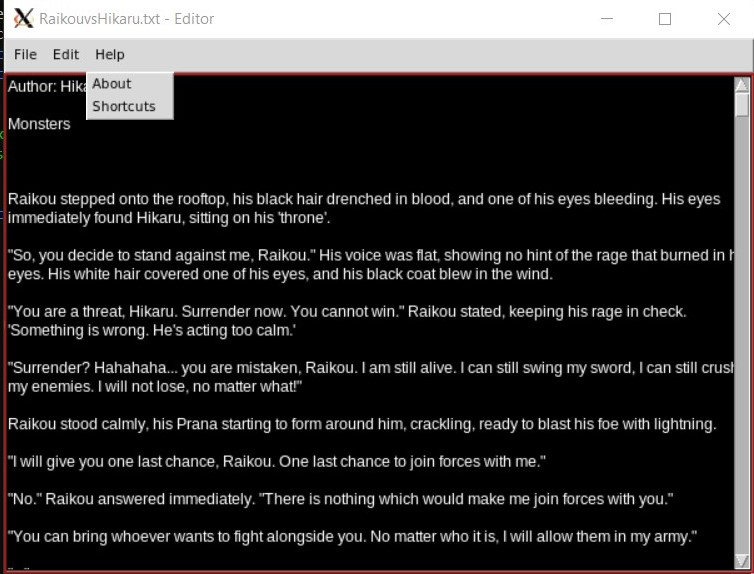
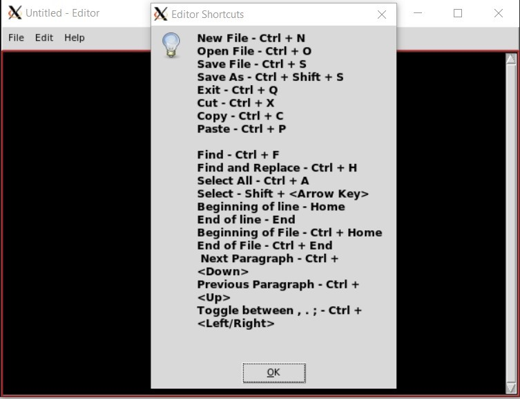

# Python Text Editor #
##### Text editor created with Python3 and Tkinter for a GUI, with multithreaded features. #####

To run the file, enter the following command into a terminal
>python3 EditorMul.py

### Functions:
#### File Menu:

##### New File:

`Text.delete(1.0,END)` is used to clear the whole area.

##### Open File:

`askopenfilename` is used to select the file to be opened.

##### Save File:

##### Save As:

`asksaveasfilename` is used to select the file in both instances of save.

##### Switch Theme:

`Text.config` is used for switching between the themes.

##### Exit:
`askokcancel` is used to confirm from the user whether they want to exit the application and then `destroy()` method is run to destroy the instance and close the application.

#### Edit Menu:

##### Select All:

Tkinter events `select(1.0,END)`, cut, copy, paste are used for the Select All, Cut, Copy, Paste functions respectively.

##### Find:

>def \__find(self,event=None):
>
>>		t1=threading.Thread(target=self.\__finder());
>
>>		t1.start()
>
>>		t1.join()
>
Multithreading has been implemented in find feature.

##### Find and Replace:

>def \__findNReplace(self,event=None):
>
>>t1=threading.Thread(target=self.\__findNReplaceF())
>
>>t1.start()
>
>>t1.join()
>
Multithreading has been implemented to ensure that Find and Replace does not interfere with working of the editor.

##### Clear All:

##### Spell Check:

**Note:** Spell Check function works only with .txt files. 
>def \__SpellCheck(self,event = None):
>
>>t1=threading.Thread(target=self.\__SpellChecker())
>
>>t1.start()
>
>>t1.join()
>
Multithreading has been implemented in the Spell Check function to work parallelly and not block the working of the editor itself.

#### Help Menu:

##### Shortcuts:

`messagebox.showinfo()` is used to show the list of available shortcuts to the user.
